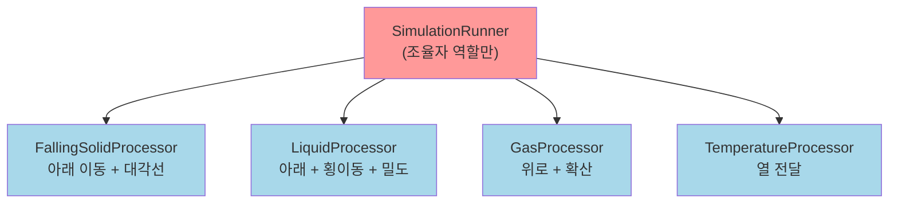
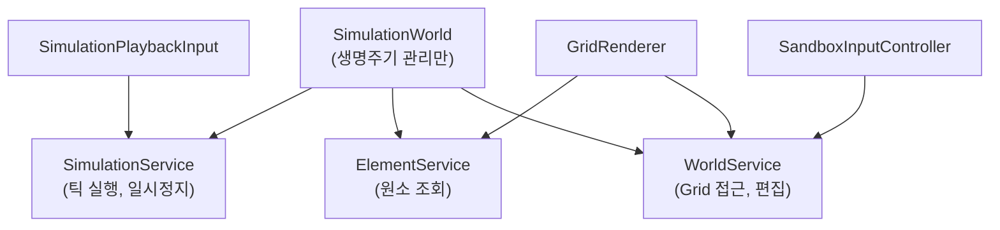
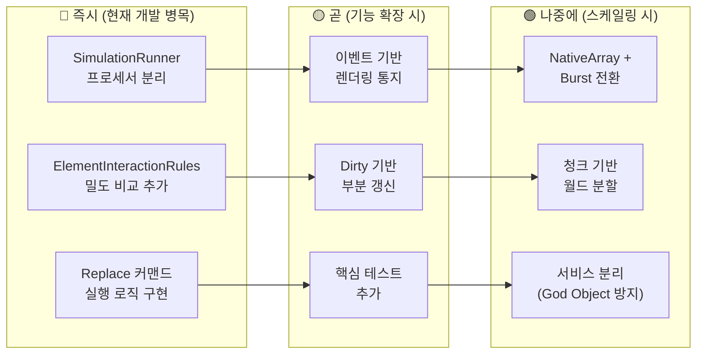

# 시스템 구조 종합 평가

> Phase 1~7 분석 기반 — 로직이 아닌 **구조와 설계**에 대한 평가

---

## 1. 아키텍처 강점 — 잘 갖춰진 기반

### 1.1 레이어 분리와 단방향 의존성

```
Core.Simulation.Data          (의존성 없음)
Core.Simulation.Commands      (의존성 없음)
       ↑
Core.Simulation.Definitions   (Data에만 의존)
       ↑
Core.Simulation.Runtime       (Data, Commands, Definitions에 의존)
       ↑
Core.Simulation.Rendering     (Data, Runtime에 의존)
Core.Simulation.Interaction   (Runtime, Rendering, Definitions에 의존)
```

**순환 의존성 없음 ✓** — 하위 레이어는 상위를 모르고, 상위만 하위에 의존합니다. 이 구조는 레이어 하나를 교체하거나 테스트할 때 다른 레이어에 영향을 주지 않는 핵심 기반입니다.

### 1.2 값 타입 중심 설계

| 구조체 | GC 압박 | 캐시 친화 | 불변성 |
|---|---|---|---|
| `SimCell` (8B) | ✅ 없음 | ✅ 연속 배열 | mutable (의도적) |
| `TickMeta` (12B) | ✅ 없음 | ✅ 연속 배열 | mutable (의도적) |
| `SimulationCommand` | ✅ 없음 | ✅ List 내 연속 | ✅ readonly struct |
| `ElementRuntimeDefinition` | ✅ 없음* | ✅ 배열 내 | ✅ readonly struct |

> \* `string Name` 필드는 참조 타입이지만, 원소 정의가 256개 이하이므로 GC 영향 미미

### 1.3 Collect-then-Apply 커맨드 패턴

스캔과 실행을 분리한 것은 단순한 설계 선택이 아니라 **확장의 기반**입니다:
- **Undo/Redo** — 커맨드 리스트를 히스토리 스택에 저장
- **Replay** — 틱 번호 + 커맨드 시퀀스로 시뮬레이션 재현
- **네트워킹** — 커맨드를 직렬화하여 서버/클라이언트 동기화
- **디버깅** — 특정 틱의 커맨드 목록을 시각화

### 1.4 SO → Runtime 데이터 파이프라인

에디터(디자이너) ↔ 런타임(성능)을 깔끔하게 분리합니다. 디자이너가 Inspector에서 원소를 편집하면 코드 수정 없이 새 원소가 추가됩니다.

---

## 2. 구조적 개선점

### 2.1 SimulationRunner — 단일 클래스에 과중한 책임

**현재 SimulationRunner가 담당하는 것:**
- 틱 파이프라인 조율 (Step)
- 행동 필터링 (IsFallingSolid 체크)
- 전체 셀 순회 (ScanAndCreateCommands)
- 예약 관리 (TryReserveMove)
- 커맨드 실행 (ApplyCommands, ApplyMove)

Liquid, Gas, 대각선 낙하, 온도 전파 등이 추가되면 이 클래스가 급격히 비대해집니다.

**제안: 행동별 프로세서 분리**



```csharp
// 현재: SimulationRunner 안에 모든 로직
if (!ElementInteractionRules.IsFallingSolid(actorElement))
    continue;
// ... 아래 이동 로직 전부

// 개선: 프로세서 인터페이스
public interface ICellProcessor
{
    bool CanProcess(in ElementRuntimeDefinition element);
    void Process(int x, int y, int currentTick, WorldGrid grid,
                 ElementRegistry registry, List<SimulationCommand> commands);
}

// SimulationRunner는 프로세서를 순회만
foreach (var processor in _processors)
{
    if (processor.CanProcess(in element))
        processor.Process(x, y, ...);
}
```

**이점:**
- 각 프로세서가 독립 테스트 가능
- 새 행동 추가 시 프로세서 클래스만 추가
- SimulationRunner는 순회 + 조율만 담당

---

### 2.2 ElementInteractionRules — 확장 시 조건문 폭증

**현재:**
```csharp
public static DownInteractionResult EvaluateDownInteraction(...) {
    if (target.Id == BuiltInElementIds.Vacuum) return Move;
    if (target.DisplacementPriority < actor.DisplacementPriority) return Replace;
    return Blocked;
}
```

Liquid→Liquid 밀도 비교, Gas 상호작용, 온도 기반 상태 변화가 추가되면:

```csharp
// 예상되는 조건문 폭증:
if (target is Vacuum) → Move
else if (cross-type priority) → Replace
else if (same-type liquid density) → Replace
else if (same-type gas density) → Replace
else if (temperature causes state change) → ???
else if (pressure dynamic) → ???
// ... 관리 불가능
```

**제안: 규칙 테이블 또는 전략 패턴**

```csharp
// 방법 1: 규칙 테이블 (데이터 주도)
InteractionResult EvaluateInteraction(
    in ElementRuntimeDefinition actor,
    in ElementRuntimeDefinition target,
    Direction direction)
{
    // 1단계: 타입 간 규칙 (DisplacementPriority)
    var crossTypeResult = _crossTypeRules.Evaluate(actor, target);
    if (crossTypeResult != InteractionResult.Continue)
        return crossTypeResult;

    // 2단계: 같은 타입 내 규칙 (Density)
    var sameTypeResult = _sameTypeRules.Evaluate(actor, target);
    if (sameTypeResult != InteractionResult.Continue)
        return sameTypeResult;

    // 3단계: 방향별 특수 규칙
    return _directionRules.Evaluate(actor, target, direction);
}
```

---

### 2.3 렌더링 — 시뮬레이션과 직접 결합

**현재 문제:**
```csharp
// SimulationWorld.StepOneTickInternal()
_simulationRunner?.Step(_currentTick);
gridRenderer.RefreshAll();           // ← 시뮬레이션과 렌더링이 직접 연결

// WorldEditService.SetCell()
simulationWorld.Grid.SetCell(x, y, cell);
gridRenderer.RefreshAll();           // ← 여기서도 직접 호출
```

`RefreshAll()`이 **두 곳에서 직접 호출**됩니다. 렌더링 방식이 바뀌거나, 다중 뷰(미니맵 등)가 추가되면 모든 호출 지점을 수정해야 합니다.

**제안: 이벤트 또는 Dirty 통지 패턴**

```csharp
// SimulationWorld에 이벤트 추가
public event Action OnTickCompleted;
public event Action<int, int> OnCellChanged;  // x, y

// StepOneTickInternal에서:
_simulationRunner?.Step(_currentTick);
OnTickCompleted?.Invoke();              // 렌더러가 구독

// GridRenderer에서:
simulationWorld.OnTickCompleted += () => RefreshAll();
```

**이점:**
- SimulationWorld가 GridRenderer를 직접 알 필요 없음
- 미니맵, 디버그 뷰, 통계 패널 등이 같은 이벤트를 구독 가능
- `Dirty` 기반 부분 갱신과 자연스럽게 결합

---

### 2.4 입력 시스템 — 하드코딩된 키 바인딩

```csharp
// 현재: 원소 3종이 키에 하드코딩
if (Input.GetKeyDown(KeyCode.Alpha1)) SetSelectedElement(Vacuum);
if (Input.GetKeyDown(KeyCode.Alpha2)) SetSelectedElement(Bedrock);
if (Input.GetKeyDown(KeyCode.Alpha3)) SetSelectedElement(Sand);
```

원소가 10종, 20종으로 늘어나면 숫자 키만으로는 부족합니다.

**제안: 데이터 주도 바인딩 또는 UI 선택 패널**

```csharp
// 방법 1: SO 기반 바인딩 맵
[System.Serializable]
public struct ElementKeyBinding
{
    public KeyCode key;
    public byte elementId;
}

[SerializeField] private List<ElementKeyBinding> bindings;

// 방법 2: Unity InputSystem의 InputAction 활용
// (이미 InputSystem_Actions.inputactions 파일이 프로젝트에 존재)
```

---

### 2.5 테스트 커버리지 불균형

**현재 테스트:**
```
WorldGridTests.cs  — 6개 테스트 ✓
그 외              — 0개
```

| 클래스 | 테스트 가능성 | 테스트 필요도 | 현재 |
|---|---|---|---|
| `WorldGrid` | ✅ 순수 C# | ★★★ | 6개 ✓ |
| `SimulationRunner` | ✅ 순수 C# | ★★★★★ | 없음 ✗ |
| `ElementInteractionRules` | ✅ static, 순수 함수 | ★★★★ | 없음 ✗ |
| `ElementRegistry` | ✅ 순수 C# (SO mock 필요) | ★★★ | 없음 ✗ |
| `SimulationCommand` | ✅ readonly struct | ★★ | 없음 ✗ |
| `GridRenderer` | ⚠️ MonoBehaviour 의존 | ★★ | 없음 ✗ |

**가장 시급한 것:** `SimulationRunner`와 `ElementInteractionRules` — 시뮬레이션의 정확성을 검증하는 핵심 테스트가 없으면 로직 변경 시 회귀 버그를 감지할 수 없습니다.

```csharp
// 예: SimulationRunner 테스트
[Test]
public void Sand_Falls_OneCell_PerTick()
{
    var grid = new WorldGrid(5, 5);
    var registry = CreateTestRegistry();  // Vacuum + Sand 포함
    var runner = new SimulationRunner(grid, registry);

    grid.SetCell(2, 3, new SimCell(Sand, 1000));

    runner.Step(1);

    Assert.AreEqual(Vacuum, grid.GetCell(2, 3).ElementId);
    Assert.AreEqual(Sand, grid.GetCell(2, 2).ElementId);
}
```

---

### 2.6 catch-up 틱 제한 없음

```csharp
// 현재: 무제한 while 루프
while (_tickAccumulator >= tickInterval)
{
    _tickAccumulator -= tickInterval;
    StepOneTickInternal();  // 프레임 드롭 시 수십 번 반복 가능
}
```

극단적 프레임 드롭(0.5초)에서 10TPS 기준 5틱이 한 프레임에 실행됩니다. 시뮬레이션이 복잡해지면 이 catch-up이 프레임 드롭을 **더 악화**시키는 악순환을 만들 수 있습니다.

---

### 2.7 string in readonly struct

```csharp
public readonly struct ElementRuntimeDefinition
{
    public readonly string Name;  // ← 참조 타입
    // ...
}
```

`string`이 포함되면 이 struct는 **blittable이 아닙니다**. 향후 `NativeArray<ElementRuntimeDefinition>`로 전환할 수 없습니다.

**제안: 런타임 정의에서 Name 분리**

```csharp
// 방법 1: Name을 별도 배열로
public readonly struct ElementRuntimeDefinition  // blittable
{
    public readonly byte Id;
    public readonly ElementBehaviorType BehaviorType;
    // ... (string 제외)
}

// Name은 별도 string[] 또는 Dictionary<byte, string>
private readonly string[] _elementNames = new string[256];
```

---

### 2.8 SimulationWorld의 Facade 비대화 가능성

현재 `SimulationWorld`는 `GetElement()`, `Grid`, `ElementRegistry`, `TogglePause()`, `StepOneTick()` 등 **모든 외부 접근의 창구**입니다. 시스템이 커지면 이 클래스가 God Object가 될 위험이 있습니다.

**제안: 서비스 분리**



---

## 3. 미래 확장을 위한 구조 변경 우선순위



### 우선순위 1: 프로세서 패턴 도입 (🔴)

**지금 해야 하는 이유:** Liquid/Gas 추가가 임박했습니다. 현재 `ScanAndCreateCommands`에 모든 행동을 if-else로 넣으면 즉시 관리 불가능해집니다.

### 우선순위 2: 이벤트 기반 렌더링 (🟡)

**`RefreshAll`을 직접 호출하는 곳이 이미 3곳**입니다. 기능이 추가될수록 호출 지점이 늘어나 일관성 유지가 어려워집니다.

### 우선순위 3: NativeArray + Burst (🟢)

**그리드가 200×200 이상이 될 때** 필요합니다. 현재 20×12에서는 managed 배열로 충분합니다. 다만 `StructLayout`, `IDisposable`, SoA 분리 등 전환 준비는 이미 잘 되어 있습니다.

---

## 4. 총평

```
╔══════════════════════════════════════════════════════════════╗
║                      현재 시스템 성숙도                       ║
╠═══════════════════════╦══════╦═══════════════════════════════╣
║ 데이터 구조           ║ ★★★★★ ║ struct 설계, SoA, 메모리 최적화 ║
║ 레이어 분리           ║ ★★★★☆ ║ 단방향 의존, 순환 없음         ║
║ 확장 가능성 (구조)    ║ ★★★☆☆ ║ 뼈대는 있으나 프로세서 분리 필요 ║
║ 에디터 편의           ║ ★★★★☆ ║ SO, ContextMenu, Reset 패턴   ║
║ 테스트 커버           ║ ★★☆☆☆ ║ WorldGrid만 테스트            ║
║ 성능 최적화 준비      ║ ★★★★☆ ║ NativeArray 전환 인프라 구비   ║
║ 렌더링 확장성         ║ ★★☆☆☆ ║ 직접 호출, Dirty 미활용       ║
╚═══════════════════════╩══════╩═══════════════════════════════╝
```

> [!NOTE]
> **핵심 요약:** 데이터 레이어와 기본 아키텍처는 **산소미포함급 시뮬레이션을 목표로 한 프로젝트의 초기 단계로서 매우 탄탄합니다.** `SimCell` 8바이트 구조, SoA 패턴, 커맨드 패턴, SO 파이프라인은 프로덕션 수준의 설계입니다. 현재 가장 시급한 구조적 변경은 **SimulationRunner 내의 행동별 프로세서 분리**이며, 이것이 Liquid/Gas/온도 등 모든 후속 기능의 아키텍처적 병목입니다.
